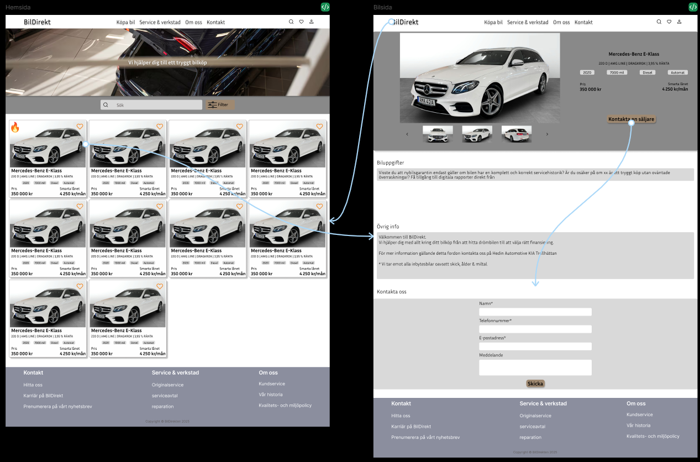
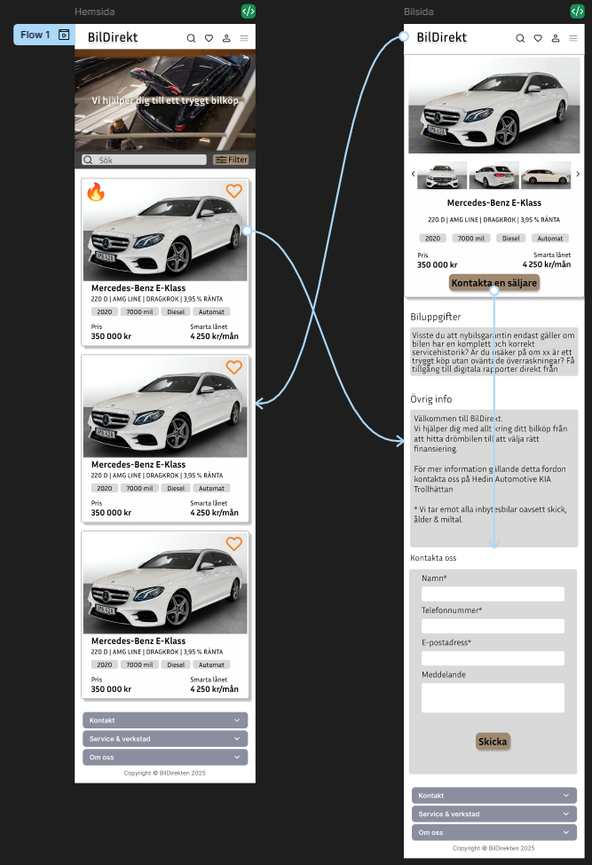

# BilDirekt

E-commerce solution for car sales.

This project is part of the UI & UX Design and Agile Methodology courses. The goal was to develop an e-commerce solution with a focus on user-centered design and Agile practices. The project was carried out using collaborative tools to ensure smooth progress and deliver a high-quality product.

## Tools & Methodology

- **Azure Boards**: Utilized for task tracking, user stories, and managing the project's workflow following Agile principles.

- **Figma**: Used for designing the UI/UX, creating interactive prototypes, and maintaining the visual design system throughout the project.

## Screenshots

### Desktop Design


### Mobile Design


## Getting Started

### Clone project
```bash
git clone https://github.com/Hazeem89/BilDirekt.git
```

### Install dependencies
```bash
npm install
```

### Start application
```bash
npm start
```